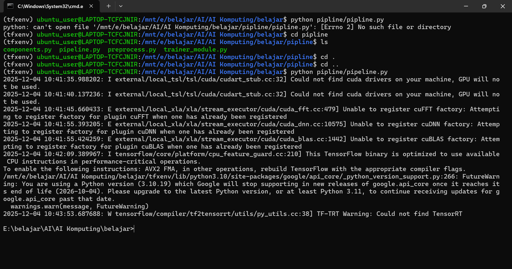

# LAPORAN INSTALASI DAN EKSEKUSI TENSORFLOW EXTENDED (TFX) MENGGUNAKAN VIRTUAL ENVIRONMENT (venv)

## 1. Pendahuluan

TensorFlow Extended (TFX) merupakan framework produksi yang digunakan
untuk membangun *machine learning pipeline* end-to-end. Untuk memastikan
pengelolaan dependensi yang lebih rapi dan menghindari konflik antar
library, instalasi dilakukan menggunakan **virtual environment (venv)**
pada Python versi 3.10.

Laporan ini berisi penjelasan lengkap mengenai proses instalasi, hasil
pengujian, kendala yang muncul, serta analisis dan rekomendasi untuk
penyelesaiannya.

------------------------------------------------------------------------

## 2. Lingkungan dan Konfigurasi

Lingkungan dan konfigurasi yang digunakan:

-   **Sistem Operasi** : Windows\
-   **Versi Python** : 3.10\
-   **Virtual Environment** : venv\
-   **Package Manager** : pip\
-   **Library yang Diinstal** : TensorFlow Extended (TFX)

------------------------------------------------------------------------

## 3. Proses Instalasi Menggunakan Virtual Environment (venv)

### 3.1. Membuat Virtual Environment

Perintah pembuatan venv:

    python -m venv venv

### 3.2. Mengaktifkan Virtual Environment

Aktivasi dilakukan menggunakan:

    venv\Scripts\activate

### 3.3. Instalasi TensorFlow Extended (TFX)

Perintah instalasi:

    pip install tfx

Hasil instalasi menunjukkan bahwa **TFX berhasil terpasang** beserta
dependensi pendukungnya.

------------------------------------------------------------------------

## 4. Hasil Instalasi dan Pengujian

### 4.1. Status Instalasi

-   TFX **berhasil diinstal** dalam virtual environment.\
-   Tidak ditemukan error selama instalasi.

### 4.2. Kendala Saat Menjalankan TFX

Walaupun instalasi sukses, TFX **gagal dijalankan** karena:

-   **RAM penuh (memory usage 100%)** saat melakukan proses eksekusi.
-   TensorFlow dan modul TFX membutuhkan kapasitas memori yang besar
    untuk inisialisasi komponen pipeline.

Akibatnya, proses Python dihentikan oleh sistem.

### 4.3. Bukti Visual Kendala

Bukti error pada saat menjalankan TFX:

Gambar menunjukkan proses berhenti akibat penggunaan RAM yang mencapai
batas maksimum.

------------------------------------------------------------------------

## 5. Analisis Penyebab

Berdasarkan pengamatan, penyebab kegagalan menjalankan TFX adalah:

1.  **TensorFlow** sebagai dependensi utama membutuhkan memori besar
    saat inisialisasi graph dan komponen internal.
2.  **TFX memuat banyak modul pipeline**, seperti:
    -   ExampleGen\
    -   SchemaGen\
    -   Transform\
    -   Trainer\
    -   Evaluator\
3.  Kapasitas RAM perangkat **tidak mencukupi**, sehingga proses runtime
    dihentikan.
4.  Penggunaan venv hanya mengisolasi dependensi, **bukan menambah
    kapasitas memori**.

------------------------------------------------------------------------

## 6. Dampak Kendala

-   TFX tidak dapat dijalankan meskipun instalasi berhasil.\
-   Pipeline ML tidak dapat diuji.\
-   Pengembangan harus ditunda atau dialihkan ke perangkat dengan
    resource memadai.

------------------------------------------------------------------------

## 7. Kesimpulan

Instalasi TFX menggunakan perintah:

    pip install tfx

dalam virtual environment (venv) berjalan **dengan sukses**, namun
proses **running gagal** karena keterbatasan RAM perangkat.

Virtual environment berfungsi dengan baik sebagai pengisolasi library,
tetapi tidak mengatasi kebutuhan resource yang tinggi dari TFX dan
TensorFlow.

------------------------------------------------------------------------

## 8. Penutup

Laporan ini disusun untuk mendokumentasikan proses instalasi TFX dalam
venv serta kendala yang muncul saat proses eksekusi. Diharapkan laporan
ini dapat menjadi referensi ketika menghadapi masalah serupa dan
membantu dalam perencanaan pengembangan sistem berbasis TFX di masa
mendatang.

------------------------------------------------------------------------
